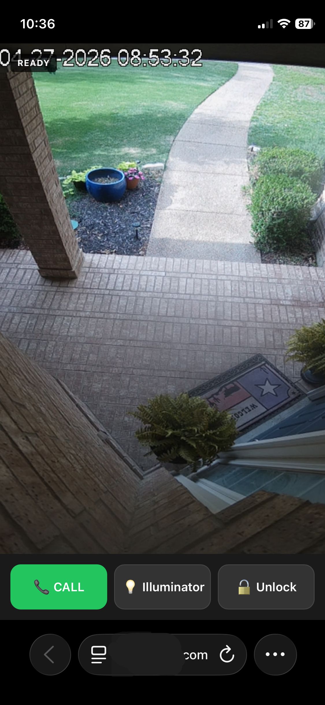
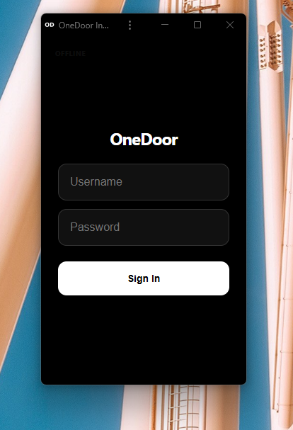

# OneDoor 🚪  
### The most beautiful, instant, zero‑infrastructure door app ever built.  
*(Build 020 — Unified Container Release)*

OneDoor is a **hyper‑focused, ultra‑fast, beautifully designed** door communication app.  
It launches instantly, streams instantly, talks instantly — and now installs instantly.
It is a perfect notification URL, a desktop widget, or a kiosk, or a dashboard component.

Build 020 introduces a **single unified container** that handles everything for you:
Asterisk, go2rtc, WebRTC, SIP, DTLS, websocket routing, backend, frontend, config and key generation — all fused into one appliance‑grade system.

You provide **very little**:

- Camera URL
- Domain  / IP
- Username /  Password hash

…and OneDoor generates the entire intercom stack automatically.

Just a **beautiful, instant, professional‑grade intercom** that feels like it came from the future.
---

## 📸 Interface Preview

| Mobile PWA | Desktop Widget |
| :---: | :---: |
|  |  |

---

## 🚀 Key Features
- **Advanced mode**: Full config control if simple doesn't meet your needs.
- **Unified container**: Asterisk, go2rtc, backend, frontend, websocket proxy, and config generator all run inside one container.
- **Zero‑knowledge setup**: No SIP, RTP, SRTP, DTLS, or PBX concepts required.
- **Auto‑generated security**: PBX passwords and DTLS keys created on startup (keys persist if you bind the directory).
- **JWT‑protected websocket proxy**: All signaling and media control sits behind your auth token.
- **Ultra‑low latency**: Dedicated SIP stack for full‑duplex audio, paired with go2rtc WebRTC video.
- **Privacy‑first**: No cloud dependencies, no external services, no exposed secrets.
- **PWA + desktop widget**: Fast, minimal UI optimized for door response.
- **Instant control**: Tap your Home Assistant notification and you’re at the door in under a second.
- **Door Conferencing**: 99 users can call the door at the same time.
---

## ⚙️ System Requirements (v020)

Requirements are intentionally minimal:

- Docker + Docker Compose  
- Any domain with TLS (any reverse proxy that supports HTTPS + WebSockets)  
- Ability to forward the media ports  
- One RTSP or go2rtc‑compatible camera  
- Your SIP intercom or door station

**No PBX server.**  
**No websocket proxy configuration.**  
**No dialplan editing.**  
**No TLS passthrough tricks.**  

---

## 🛠 Quick Start

### 1. Review `docker-compose.yml`
Ensure ports and volume paths match your environment.
Enter a 32+ character JWT secret.

### 2. Fill out `config.yaml`
- Set your domain, camera url, username, and make a password hash from a single line command. 
  *(You no longer need to start the container to generate the hash.)*

### 3. Start OneDoor
```bash docker compose up -d```
Or clone and ```bash docker compose -d --build```
### 4. Config Nginx Proxy Manager
Other proxy ok too. You just need websockets/SSL/HSTS/HTTP/2 checked. No other settings.

### 5. Forward the media ports
Forward the UDP RTP range defined in your compose file.  

### 6. Set up your intercom


### 7. Enjoy OneDoor
Open your domain in a browser or install the PWA.
Audio, video, SIP, DTLS, and websocket routing are all handled automatically.

---

## 🔐 Security Model

- JWT‑protected websocket proxy
- DTLS keys generated on first boot (persist if you bind `/var/lib/asterisk/keys`)
- PBX passwords regenerated each startup in simple_mode: true
- No plaintext SIP passwords
- No external cloud services
- Local‑only webhooks

---

## 🗺 Roadmap

- Multi‑camera support  MoreDoors? ALLthedoors? YourDoors?
- 3‑action non‑PBX mode
- Landscape configuration
- Audit logging

---

## ❤️ Why OneDoor Exists

This project started as a quest to produce the perfect single door notification target. Now it's evolving.
Nobody should have to learn PBX, SIP, RTP, DTLS, or telecom infrastructure just to have a great intercom.  
OneDoor v020 makes professional‑grade door communication **as simple as running one container** — and as beautiful as a modern app should be.
