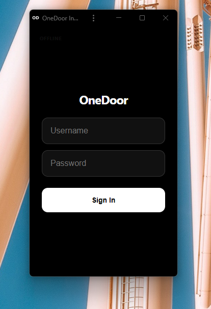

# OneDoor 🚪 — now with more doors

NVRs are great at recording, tracking, and reviewing events — even several at once.

OneDoor is something completely different.

OneDoor is built for tactical‑speed door awareness: the fastest possible video, the fastest possible audio, and instant control of your entryway. It’s the perfect real‑time notification target — now scaled out to support multiple doors, each with its own actions, audio mode, and deep‑linkable view.

Tap a notification and you’re at your door in under a second, with instant WebRTC video and full‑duplex SIP audio. If the app ever loses scope of the scene, your next step (another door, your NVR, or any external system) is always one button away — and now your next camera and action set is one swipe away.

It plays beautifully with NVRs, home automation systems, and professional SIP door stations — without forcing you to learn telecom internals.

The v040 series respects the ultra‑simple legacy SIP‑only config (non‑breaking), but introduces a powerful yet self‑explanatory unified configuration that supports single‑door or multi‑door setups with ease. SIP remains the recommended best experience, but OneDoor now works beautifully across multiple call modes and device types.

The result is a clean, ultra‑fast door application that works seamlessly with your NVR and automation stack — modern, reliable, and tuned to outperform anything in its class.

---

## 📸 Interface Preview

| Mobile PWA | Desktop Widget |
| :---: | :---: |
|  |  |

---

## 🚀 Key Features

- **Multi‑door support** — Add as many doors/cameras as you want and swipe between them instantly.
- **Multiple audio modes** —
  - `sip` for full SIP signaling and the best experience
  - `generic` for video‑channel audio + mic toggle
  - `none` for video‑channel audio without 2‑way talk
- **Per‑door action sets** — Configurable DTMF payloads, private backend webhooks, and frontend links for NVR jumps or automations.
- **Deep‑linked notifications** — Alerts take you directly to the door that was pressed.
- **Unified multi‑door config** — Powerful, simple, and self‑explanatory. Legacy SIP‑only configs remain valid.
- **Ultra‑low latency** — Full‑duplex SIP audio + go2rtc WebRTC video tuned for sub‑second response.
- **Perfect notification target** — Tap → live video + audio in under a second.
- **Next‑step actions** — Instantly jump to your NVR, another door, or any external system.
- **Secure by design** — Split‑token signaling, isolated webhooks, no secrets in the browser, no cloud, no telemetry.
- **Zero‑knowledge setup** — No PBX, SIP, RTP, SRTP, or dialplan expertise required.
- **Automatic key + credential generation** — Strong defaults, no manual crypto handling.
- **PWA + desktop widget** — Fast, minimal UI optimized for door response.
- **Ecosystem‑friendly** — Works cleanly alongside Home Assistant, Frigate, NVRs, and existing SIP hardware.
- **Appliance‑grade reliability** — Designed to run unattended, behind NAT, VPNs, and complex networks.
- **Fast Notifications** — Pure WebPush straight to Apple/Google. No Firebase. No app. Custom hooks included.

---

## ❤️ Why OneDoor Exists

OneDoor set out to solve the problem that NVRs never could: the speed gap between a doorbell event and your ability to act on it. Recording is useful later — but the moment that matters is the one happening right now.

As OneDoor evolved, the real power became clear: real‑time actions.  
That’s what drove the expansion to more doors, more modes, and per‑door control surfaces.

OneDoor is the app that captures the seconds that actually matter between notification and engagement.  
It can welcome guests, de‑escalate trouble, and give you real‑time control faster than anything else in its class — all while staying fully local, fully open, and fully in your hands.

