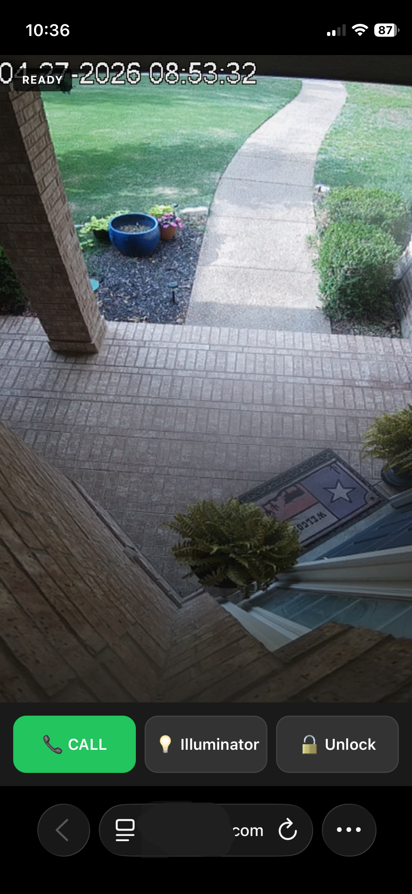

# OneDoor 🚪 — Built for the Seconds That Matter

NVRs are great at recording, tracking, and reviewing events — even several at once.

OneDoor is something completely different.

OneDoor is built for the critical seconds where things actually happen: the moment a guest arrives, a delivery needs direction, or a situation needs de‑escalation. It delivers the fastest possible video, the fastest possible audio, and instant control of your entryway — all in a clean, real‑time interface.

The v040+ series transformed OneDoor into a true multi‑door, multi‑device control surface. It’s up to **5× faster** than v037, supports **multiple audio modes**, and now includes **state‑aware actions** powerful enough to replace entire home‑automation dashboards. You may genuinely want to add an indoor camera or two just to play with it. 

SIP remains the best experience — full‑duplex, instant, and rock‑solid — but OneDoor is no longer SIP‑only. Any door, any camera, any device can now be part of the system. Preloaded streams, GOP caching, and primed WebRTC eliminate the 3‑second refresh penalty that plagues most doorbell apps. Even non‑SIP devices become fast, responsive, and actually usable.

Tap a notification and you’re at your door in under a second. Swipe to another door instantly. Trigger actions, automations, relays, lights, alarms, or NVR jumps with zero hesitation. OneDoor is now both a tactical‑speed intercom and a real‑time automation console that you can actually see. 

---

## 📸 Interface Preview

OneDoor’s interface is intentionally minimal: a single, native‑resolution stream.  
Only **one** stream is ever active at a time, keeping CPU/GPU usage extremely low.  
Speed comes from **server‑side preload + GOP caching**, and rewriting timestamps, not from overworking the client.

### Mobile App

### Desktop Widget (Video Preview)

https://github.com/user-attachments/assets/e144d909-67e6-4505-a220-b46c3598fe59

---

## 🚀 Key Features

- **Multi‑door support** — Add as many doors/cameras as you want and swipe between them instantly.
- **Multiple audio modes** —
  - `sip` for full SIP signaling and the best experience
  - `generic` for video‑channel audio + mic toggle
  - `none` for video‑channel audio without 2‑way talk
- **Per‑door action sets** — Configurable DTMF payloads, private backend webhooks, frontend links, and state‑aware toggle actions for locks, lights, and automations.
- **Deep‑linked notifications** — Alerts take you directly to the door that was pressed.
- **Unified multi‑door config** — Powerful, simple, and self‑explanatory. Legacy SIP‑only configs remain valid.
- **Ultra‑low latency** — Full‑duplex SIP audio + go2rtc WebRTC video tuned for sub‑second response.
- **Perfect notification target** — Tap → live video + audio in under a second.
- **Next‑step actions** — Instantly jump to your NVR, another door, or any external system.
- **Secure by design** — Split‑token signaling, isolated webhooks, no secrets in the browser, no cloud, no telemetry.
- **Zero‑knowledge setup** — No PBX, SIP, RTP, SRTP, or dialplan expertise required.
- **Automatic key + credential generation** — Strong defaults.
- **PWA + desktop widget** — Fast, minimal UI optimized for door response. Also keyboard support.
- **Ecosystem‑friendly** — Works cleanly alongside Home Assistant, Frigate NVR, and existing SIP hardware.
- **Appliance‑grade reliability** — Designed to run unattended, behind NAT, VPNs, and complex networks.
- **Fast Notifications** — Pure WebPush straight to Apple/Google. No Firebase. No app. Custom hooks accepted.

---

## ❤️ Why OneDoor Exists

OneDoor started with one goal: take back the seconds that matter. But solving that problem pushed the project forward — unified Docker became a universal build, limited compatibility became support for any camera, simple actions became powerful automations, slow swiping led to preload + GOP caching, complexity demanded better docs, and growing needs created state‑aware toggles. The mission stayed the same, the feature set grew around it.

OneDoor exists to put you directly inside the critical seconds where hospitality, communication, safety, and maybe a little fun actually happen.
